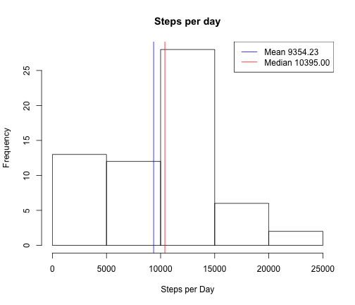
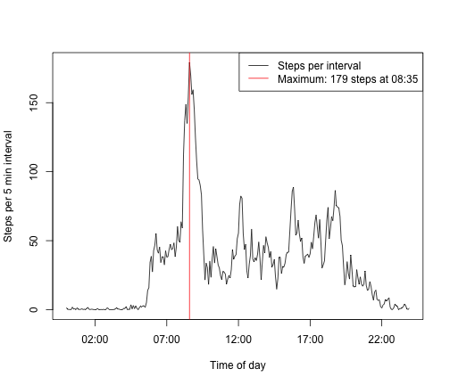
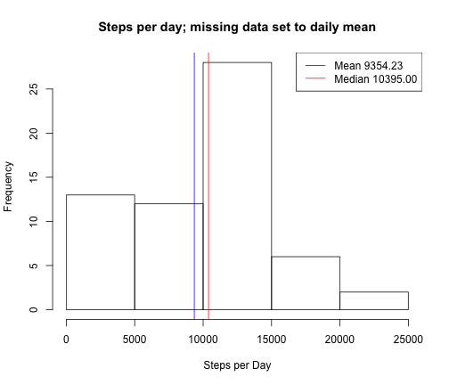
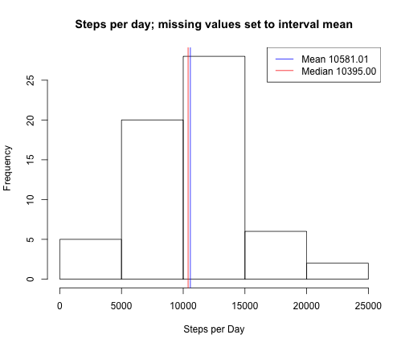
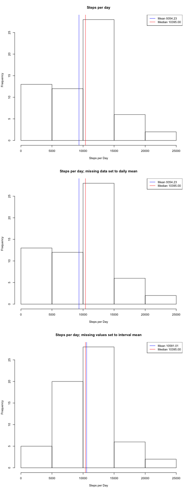
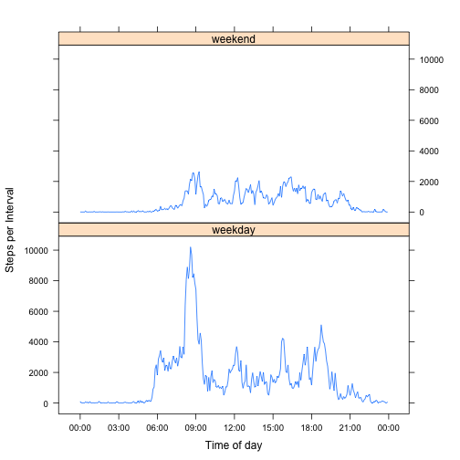

# Reproducible Research: Peer Assessment 1

## Loading and preprocessing the data

```r
zipFile<-"activity.zip"
# get the name of the 1st file in the ZIP
dataFile<-unzip(zipFile,list=TRUE)[1]
# unzip and read from the 1st file in the ZIP
unz<-unz(zipFile,dataFile)
data<-read.csv(unz,header=TRUE, sep=",",na.strings="NA", 
               colClasses=c("numeric","Date", "numeric"))
```

## What is mean total number of steps taken per day?

To calculate the mean of total number of steps per day we first have to 
calculate the sum of steps per interval and group by day making sure that NA 
values are ignored (assumed to be zero):

```r
stepsPerDay<-with(data,tapply(steps,date,sum,na.rm=TRUE))
```

Then a histogram can be created:

```r
# Base functions
drawHist <- function (data, ...){
    # draw histogram
    hist (data, ...)
    
    # add mean and median
    mean<-mean(data)
    median<-median(data)
    abline(v=mean,col="blue")
    abline(v=median,col="red")
    legend("topright",col=c("blue","red"),
           legend=c(paste ("Mean", format (mean,nsmall=2, scientific=FALSE)), 
                    paste("Median", format (median,nsmall=2, scientific=FALSE))),
           lty=1)   
    }

drawHist (stepsPerDay, xlab="Steps per Day", 
          main="Steps per day")
```

 

## What is the average daily activity pattern?
To determine the daily activity pattern we need to sum the recorded steps per 
time interval. For the plot we need X axis values covering the time intervals 
from 00:00 to 23:55 in 5 minute steps. We document the interval with the 
maximum number of steps as a vertical line in the plot. The actual maximum is 
displayed in the legend.

```r
# sum steps per interval
actPat<-with(data,tapply(steps,interval,sum,na.rm=TRUE))

# need to divide by number of days
actPat<-actPat/length(unique(data$date))

# sequence modeling the X axis
ts<-seq(as.POSIXct("2014-01-01 00:00:00"), as.POSIXct("2014-01-01 23:55:00"),
        as.difftime(5, units="mins") )

# Plot the data
plot (actPat~ts,type="l",xlab="Time of day", ylab="Steps per 5 min interval")

# Add marker for max interval
maxI<-which.max(actPat)[[1]]
abline(v=ts[maxI], col="red")
legend("topright",col=c("black","red"),
       legend=c("Steps per interval", 
                paste ("Maximum:", format(actPat[[maxI]], digits=0,scientific=FALSE), "steps at", 
                       format (ts[maxI], "%H:%M"))), 
       lty=1)
```

 


## Imputing missing values

```r
missing<-sum(is.na(data$steps))
```
The dataset has 2304 missing values for steps per interval. The previous assessment assumed 0 steps for each interval missing input data. To fill missing data we could
* set the missing data to the average steps per interval of that day
* set the missing data to the average steps per interval over all days

### Set missing data to the average steps per interval of a day

```r
# create array of average steps per day with same dimension as steps
stepAverage<-stepsPerDay[format(data$date,"%Y-%m-%d")]/288
# create copy of steps data
corr1Steps<-data$steps
# insert average steps per day for NAs
corr1Steps[is.na(data$steps)]<-stepAverage[is.na(data$steps)]

# Create histogram with mean and median
corr1StepsPerDay<-tapply(corr1Steps,data$date,sum)
drawHist (corr1StepsPerDay, xlab="Steps per Day", 
          main="Steps per day; missing data set to daily mean")
```

 

Interestingly this seems not to change the mean and median. The reason is that 
the dataset always only has NA for all intervals of a day. There are no days 
that have valid data and only NAs for some intervals. Hence replacing NAs with 
the daily average (which is zero if only NAs exist for that day) doesn't change
the situation. Also the daily total number of steps does not change as days w/o any recorded steps now continue to have no recorded steps;
* Total number of steps in original dataset: 
570608
* Total number of steps in dataset with missing values set to daily average: 
570608


### Set missing data to the mean of that 5 minute interval

```r
# create array of average steps per interval with same dimension as steps
intMean<-actPat[format(data$interval,digits=0,trim=TRUE)]

# create copy of steps data
corr2Steps<-data$steps
# insert average steps per day for NAs
corr2Steps[is.na(data$steps)]<-intMean[is.na(data$steps)]

# Create histogram with mean and median
corr2StepsPerDay<-tapply(corr2Steps,data$date,sum)
drawHist (corr2StepsPerDay, xlab="Steps per Day", 
          main="Steps per day; missing values set to interval mean")
```

 

This increases the mean as days w/o any activity now have activities
at almost all intervals. The median stays the same as the daily activity for 
days for which steps got added is less than the mean. Also the total number of 
steps increases:
* Total number of steps in original dataset: 
570608
* Total number of steps in dataset with missing values set to interval average: 
645442

Comparison of all histograms:

```r
par(mfrow=c(3,1))
drawHist (stepsPerDay, xlab="Steps per Day", 
          main="Steps per day")
drawHist (corr1StepsPerDay, xlab="Steps per Day", 
          main="Steps per day; missing data set to daily mean")
drawHist (corr2StepsPerDay, xlab="Steps per Day", 
          main="Steps per day; missing values set to interval mean")
```

 

## Are there differences in activity patterns between weekdays and weekends?


```r
# Create factor variable: "weekday/weekend
# $wday of POSIXlt is number of day in week:
# 0: Sunday, 1: Monday, ..., 6: Saturday
data$weekend<-factor(as.POSIXlt(data$date)$wday %in% c(0,6))
levels(data$weekend)=c("weekday","weekend")

# Aggregate steps by 5 min interval and factor variable weekend
aggData<-aggregate(corr2Steps,by=list(data$interval,data$weekend), FUN=sum, na.rm=TRUE)
colnames(aggData)<-c("interval","weekend","steps")

# convert interval to POSIXct
# formatC used to get to fixed length numeric with leading zeroes
# as.POSIXct interprets that as hours and minutes
aggData$interval <-as.POSIXct(formatC(aggData$interval, width=4, flag="0"),format="%H%M")

# Ticks in X axis: 00:00, 03:00, 06:00, ..., 00:00
xTicks<-seq(from=aggData$interval[1], length.out=9, by="3 hour")

# Plot data
library(lattice)
xyplot(aggData$steps ~ aggData$interval|aggData$weekend,type="l",
       layout=(c(1,2)),xlab="Time of day", ylab="Steps per Interval",
       scales=list(
           x=list(
               at=xTicks,
               labels=format(xTicks,"%H:%M")
               )
           )
       )
```

 
